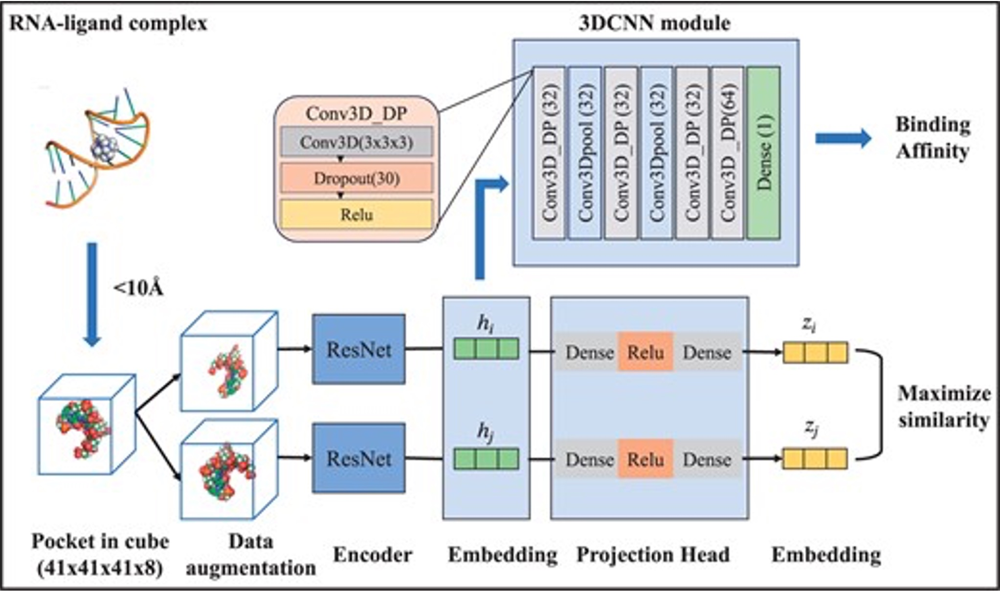

# RLaffinity
Contrastive 3D Convolution Neural Network for RNA and small molecule binding affinity prediction.
[[RLaffinity source code]](https://github.com/SaisaiSun/RLaffinity/tree/main)




## Inference

1. process pdb
```
python process_pdb.py --ligands_path example_data/ligand_pdb/ --rna_path example_data/rna_pdb/ --output_dir example_output_dir/ --dist 6.0
```

2. prepare lmdb
```
python prepare_lmdb.py --input_file_path './example_output_dir/' --output_root './example_output_mdb/' --score_path './pdbbind_NL_cleaned.csv'
```

3. inference model
```
python test.py --data_dir 'example_output_mdb/data' --output_dir 'example_output_result'
```

## Retrain
```
sbatch run_train.sh
```